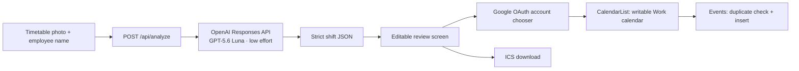

# Shiftly

Turn a photo of a weekly paper work timetable into reviewed Google Calendar shifts.

Shiftly finds an employee by name, reads their row across the weekly columns, converts the detected times into editable events, and adds approved shifts to a writable Google Calendar named **Work**.


> Status: private early release. The interface and deployment are working; real timetable extraction and Google Calendar sync require the two environment values described below.

## Contents

- [Product flow](#product-flow)
- [Features](#features)
- [Architecture](#architecture)
- [Requirements](#requirements)
- [Local setup](#local-setup)
- [OpenAI setup](#openai-setup)
- [Google Calendar setup](#google-calendar-setup)
- [Environment variables](#environment-variables)
- [Development and validation](#development-and-validation)
- [Deployment](#deployment)
- [Privacy and security](#privacy-and-security)
- [Troubleshooting](#troubleshooting)
- [Known limitations](#known-limitations)

## Product flow

1. Enter the name exactly as it appears on the paper timetable.
2. Take a photo or select one from the device.
3. Shiftly finds the matching employee row and reads each day column.
4. Review the extracted dates and times. Low-confidence cells are highlighted.
5. Select, edit, or remove shifts before continuing.
6. Choose a Google account through Google's account chooser.
7. Add the selected events to that account's writable `Work` calendar.

Nothing is written to Google Calendar before the final confirmation button is pressed. An `.ics` download is available when Google Calendar is not connected.

## Features

- Mobile camera capture and desktop image upload
- Employee-name row matching
- Day-header and date interpretation
- Structured shift extraction with `gpt-5.6-luna`
- Editable start and end times
- Low-confidence warnings instead of silent guessing
- Google account chooser with the connected email shown in the UI
- Writable `Work` calendar discovery
- Duplicate protection using private Google Calendar event properties
- `.ics` calendar export
- Responsive, keyboard-accessible review flow
- Demonstration mode when no OpenAI API key is configured

## Architecture



### Application layers

| Area | Location | Responsibility |
| --- | --- | --- |
| Main interface | `app/page.tsx` | Photo selection, shift review, Google connection, event insertion, and ICS export |
| Analysis endpoint | `app/api/analyze/route.ts` | File validation, image encoding, OpenAI request, and structured response parsing |
| Styling | `app/globals.css` | Responsive layout and visual system |
| Metadata | `app/layout.tsx` | Page title, description, icons, and social preview |
| Hosting worker | `worker/index.ts` | Cloudflare-compatible application entrypoint |
| Hosting configuration | `.openai/hosting.json` | Sites project and optional resource bindings |

The analysis endpoint accepts an image up to 10 MB and sends it to the OpenAI Responses API as an in-memory data URL. The model is required to return a strict schema containing the day, date, start time, end time, title, and confidence for every detected shift.

## Requirements

- Node.js 22.13 or newer
- npm
- An OpenAI API key with access to `gpt-5.6-luna`
- A Google Cloud project
- Google Calendar API enabled in that project
- A Google OAuth 2.0 web client ID
- A Google Calendar named exactly `Work`

## Local setup

```bash
git clone https://github.com/AyBeeee/shiftly.git
cd shiftly
npm install
cp .env.example .env.local
```

Add the required values to `.env.local`:

```env
OPENAI_API_KEY=your_openai_api_key
NEXT_PUBLIC_GOOGLE_CLIENT_ID=your_google_oauth_web_client_id
```

Start the local server:

```bash
npm run dev
```

Open the exact local URL printed in the terminal. Restart the development server after changing environment values.

## OpenAI setup

1. Create an API key in the OpenAI platform.
2. Add it to `.env.local` as `OPENAI_API_KEY`.
3. Keep the key server-side. Never expose it through a `NEXT_PUBLIC_` variable.
4. Ensure the API project can use `gpt-5.6-luna`.

The active request uses:

- Model: `gpt-5.6-luna`
- Reasoning effort: `low`
- Image detail: `high`
- Endpoint: Responses API
- Output: strict JSON schema

High image detail is intentional because timetable cells often contain small text. Low reasoning effort keeps usage modest while still allowing the model to follow row and column relationships.

If `OPENAI_API_KEY` is missing, `/api/analyze` returns demonstration shifts. This makes the review interface testable but does **not** analyze the uploaded timetable.

## Google Calendar setup

### 1. Prepare Google Cloud

1. Create or select a project in Google Cloud Console.
2. Enable the **Google Calendar API**.
3. Configure the OAuth consent screen.
4. Add yourself as a test user while the OAuth app remains in testing mode.
5. Create an OAuth 2.0 client ID with application type **Web application**.

### 2. Add authorized origins

Add every origin from which Shiftly will run. Typical values are:

```text
http://localhost:3000
https://shiftly-work-rota.baig-wally.chatgpt.site
```

If the local server chooses another port, add the exact origin it prints. This token-based browser flow does not require a redirect URI.

### 3. Configure the app

Copy the OAuth **client ID** into `NEXT_PUBLIC_GOOGLE_CLIENT_ID`. Do not create or add a client secret to the browser application.

### 4. Create the destination calendar

In the Google account that will receive shifts:

1. Open Google Calendar.
2. Create a new calendar.
3. Name it exactly `Work`.
4. Ensure the connected account has write access.

### How Shiftly chooses the account

**Connect Google** opens Google's own account chooser. Google returns a short-lived OAuth access token for the selected account. Shiftly uses that token to:

1. Display the selected account email.
2. Request that user's calendar list with a minimum access role of `writer`.
3. Find the writable calendar whose name equals `Work`.
4. Check for existing Shiftly events.
5. Insert the approved events.

The token is held in memory only. Reloading the page or token expiration requires reconnecting.

## Environment variables

| Variable | Required | Exposure | Purpose |
| --- | --- | --- | --- |
| `OPENAI_API_KEY` | For real OCR | Server secret | Authenticates timetable-analysis requests |
| `NEXT_PUBLIC_GOOGLE_CLIENT_ID` | For Google sync | Public browser identifier | Starts Google's OAuth account chooser |

`.env.example` contains names only and is safe to commit. `.env`, `.env.local`, and other real environment variants are ignored by Git.

## Development and validation

| Command | Purpose |
| --- | --- |
| `npm run dev` | Start the development server |
| `npm run lint` | Run ESLint |
| `npm run build` | Build the production worker and static assets |
| `npm run start` | Start the built application locally |

Before committing a release:

```bash
npm run lint
npm run build
```

The repository still contains the starter's legacy rendered-HTML test script, which targets the removed loading skeleton. It is not a valid Shiftly application test and should be replaced before `npm test` is used as a release check.

Recommended application tests to add next:

- Analysis endpoint validation and demo-mode responses
- Structured shift parsing
- Overnight and malformed time handling
- ICS generation
- Google duplicate detection
- Expired OAuth token recovery

## Deployment

The project is configured for a private Sites deployment and produces Cloudflare Worker-compatible output.

Deployment requirements:

1. Run `npm run build` successfully.
2. Configure `OPENAI_API_KEY` as a secret in the hosting environment.
3. Configure `NEXT_PUBLIC_GOOGLE_CLIENT_ID` as an environment value.
4. Add the deployed origin to the Google OAuth web client.
5. Deploy the validated commit.
6. Test Google connection and a real timetable before routine use.

The current private deployment is:

[https://shiftly-work-rota.baig-wally.chatgpt.site](https://shiftly-work-rota.baig-wally.chatgpt.site)

Private Sites access may show a separate ChatGPT hosting sign-in before Shiftly loads. That gate controls who can open the private deployment; the Google account chooser independently controls which calendar receives events.

## Privacy and security

- Timetable images are processed in memory by the application and sent to the configured OpenAI API project.
- The application does not write uploaded photos to its database or filesystem.
- The employee name is saved in the browser's local storage for convenience.
- The OpenAI key is used only on the server.
- The Google OAuth client ID is public by design and is not a secret.
- Google access tokens stay in browser memory and are not written to local storage or the server.
- Calendar access is requested only through Google's consent flow.
- No event is inserted before the user reviews the shifts and presses the final button.
- Duplicate detection uses a private `shiftlyKey` event property.
- Real environment files are excluded from source control.

Review the data-processing and retention settings of the OpenAI and Google projects before using Shiftly with employee information.

## Troubleshooting

| Message or symptom | Likely cause | Fix |
| --- | --- | --- |
| `Preview mode is on` | `OPENAI_API_KEY` is missing | Add the key and restart or redeploy |
| `Google Calendar needs a Google OAuth web client ID` | `NEXT_PUBLIC_GOOGLE_CLIENT_ID` is missing | Add the client ID and rebuild/redeploy |
| Google popup reports an origin error | Current origin is not authorized | Add the exact scheme, host, and port to Authorized JavaScript origins |
| Google consent blocks the user | OAuth app is in testing and the account is not allowed | Add the account as an OAuth test user or publish the consent app |
| No writable calendar named `Work` | Calendar is missing, differently named, or read-only | Create `Work` or grant the selected account write access, then reconnect |
| Google session expired | Short-lived access token expired | Press **Connect Google** and retry |
| No shifts found | Name mismatch or unreadable image | Use the printed name and retake the photo with the full table visible |
| Times appear uncertain | One or more cells were difficult to read | Correct highlighted values before importing |
| Events use an unexpected timezone | Browser timezone differs from the work location | Correct the device/browser timezone before importing |

## Known limitations

- The complete day/date header and employee-name column must be visible.
- Employee matching works best with the exact printed name.
- Only one timetable image is analyzed per import.
- The destination calendar name is fixed to `Work`.
- Overnight shifts are not yet modeled across two dates.
- Access tokens are not refreshed in the background.
- Unusual layouts, handwriting, glare, blur, or perspective distortion may require manual corrections.
- Demo mode uses fixed sample shifts and must not be mistaken for real extraction.
- Automated Shiftly-specific test coverage has not yet replaced the starter test.

## Repository policy

- The repository is private.
- Do not commit `.env` files, API keys, OAuth tokens, or employee timetable photos.
- Keep secrets in local or hosted environment configuration only.
- Run lint and build before pushing changes.

## License

Private project. No license is granted for copying, redistribution, or commercial use.
