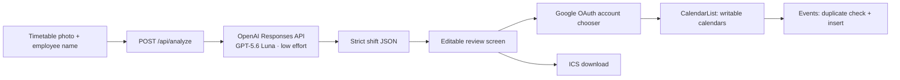

# Shiftly

Turn a photo of a weekly paper work timetable into reviewed Google Calendar shifts.

Shiftly finds an employee by name, reads their row across the weekly columns, converts the detected times into editable events, and adds approved shifts to the user's chosen Google Calendar.


> Status: private early release. Timetable extraction uses a private hosted OpenAI key. Direct Google Calendar sync additionally requires the Google OAuth web client ID described below. Shiftly never substitutes sample shifts when real analysis is unavailable.

## Contents

- [Product flow](#product-flow)
- [Features](#features)
- [Architecture](#architecture)
- [Requirements](#requirements)
- [Local setup](#local-setup)
- [OpenAI setup](#openai-setup)
- [Google Calendar setup](#google-calendar-setup)
- [Environment variables](#environment-variables)
- [Development and validation](#development-and-validation)
- [Deployment](#deployment)
- [Privacy and security](#privacy-and-security)
- [Troubleshooting](#troubleshooting)
- [Known limitations](#known-limitations)

## Product flow

1. Enter the name exactly as it appears on the paper timetable.
2. Take a photo or select one from the device.
3. Shiftly finds the matching employee row and reads each day column.
4. Review the extracted dates and times. Low-confidence cells are highlighted.
5. Select, edit, or remove shifts before continuing.
6. Choose a Google account through Google's account chooser.
7. Choose a writable calendar or use the account's default calendar.
8. Add the selected events to that calendar.

Nothing is written to Google Calendar before the final confirmation button is pressed. An `.ics` download is available when Google Calendar is not connected.

## Features

- Mobile camera capture and desktop image upload, including HEIC/HEIF photos from iPhone
- Client-side HEIC/HEIF to PNG conversion before the standard upload workflow
- Automatic client-side optimization of large timetable photos
- Employee-name row matching
- Day-header and date interpretation
- Private server-side OpenAI vision analysis
- No API-key controls or secrets exposed in the browser
- Editable start and end times
- Low-confidence warnings instead of silent guessing
- Google account chooser with the connected email shown in the UI
- Writable calendar selection with default-calendar fallback
- Duplicate protection using private Google Calendar event properties
- `.ics` calendar export
- Responsive, keyboard-accessible review flow
- Fail-closed configuration errors instead of fabricated demo shifts

## Architecture



### Application layers

| Area | Location | Responsibility |
| --- | --- | --- |
| Main interface | `app/page.tsx` | Photo selection, shift review, Google connection, event insertion, and ICS export |
| Analysis endpoint | `app/api/analyze/route.ts` | File validation, image encoding, private OpenAI request, and structured response parsing |
| Styling | `app/globals.css` | Responsive layout and visual system |
| Metadata | `app/layout.tsx` | Page title, description, icons, and social preview |
| Runtime configuration | `next.config.ts` | Allows optimized timetable uploads through the hosted request layer |
| Hosting worker | `worker/index.ts` | Cloudflare-compatible application entrypoint |
| Hosting configuration | `.openai/hosting.json` | Sites project and optional resource bindings |

The browser accepts JPEG, PNG, WebP, and HEIC/HEIF images up to 50 MB. HEIC/HEIF images are decoded locally in the browser and converted to a PNG so they can be previewed and processed by the same workflow as other supported images. Files larger than 3 MB are resized to a maximum 3200-pixel edge and progressively encoded as JPEG until they fit safely within the hosted request limit, including multipart overhead. The analysis endpoint applies a final 10 MB limit, then sends the normalized image to OpenAI in memory. The model must return a strict schema containing the day, date, start time, end time, title, and confidence for every detected shift.

## Requirements

- Node.js 22.13 or newer
- npm
- An OpenAI API key with access to the configured model
- A Google Cloud project
- Google Calendar API enabled in that project
- A Google OAuth 2.0 web client ID

## Local setup

```bash
git clone https://github.com/AyBeeee/shiftly.git
cd shiftly
npm install
cp .env.example .env.local
```

Add the required values to `.env.local`:

```env
OPENAI_API_KEY=your_openai_api_key
GOOGLE_CLIENT_ID=your_google_oauth_web_client_id
```

`OPENAI_API_KEY` remains server-side. `GOOGLE_CLIENT_ID` is returned to the browser because Google OAuth client IDs are public identifiers, not secrets.

Start the local server:

```bash
npm run dev
```

Open the exact local URL printed in the terminal. Restart the development server after changing environment values.

## OpenAI setup

Configure `OPENAI_API_KEY` as a private server secret locally and in the hosting environment. The application contains no API-key input and never returns the key to the browser.

The active request uses `gpt-5.6-luna`, low reasoning effort, high image detail, the Responses API, and strict structured JSON output.

Never expose the key through a `NEXT_PUBLIC_` variable or commit it to source control. The hosted secret is the permanent configuration.

The extraction prompt explicitly finds the printed day/date headers, matches only the requested employee row, reads its cell intersections from left to right, and ignores blank cells, days off, totals, store hours, highlighting, and neighboring rows. OpenAI uses high image detail because timetable cells contain small text; its low reasoning effort keeps usage modest.

If the hosted key is missing, `/api/analyze` returns a clear configuration error and no shifts. It never substitutes sample events for an uploaded timetable.

## Google Calendar setup

### 1. Prepare Google Cloud

1. Create or select a project in Google Cloud Console.
2. Enable the **Google Calendar API**.
3. Configure the OAuth consent screen.
4. Add yourself as a test user while the OAuth app remains in testing mode.
5. Create an OAuth 2.0 client ID with application type **Web application**.

### 2. Add authorized origins

Add every origin from which Shiftly will run. Typical values are:

```text
http://localhost:3000
https://shiftly-work-rota.baig-wally.chatgpt.site
```

If the local server chooses another port, add the exact origin it prints. This token-based browser flow does not require a redirect URI.

### 3. Configure the app

Copy the OAuth **client ID** into the hosted `GOOGLE_CLIENT_ID` value. Do not create or add a client secret to the browser application.

### 4. Choose the destination calendar

Shiftly defaults to the selected Google account's primary calendar. After connecting Google, the review screen also shows writable calendars from that account so the user can choose a different destination before adding shifts.

### How Shiftly chooses the account

**Connect Google** opens Google's own account chooser. Google returns a short-lived OAuth access token for the selected account. Shiftly uses that token to:

1. Display the selected account email.
2. Request that user's calendar list with a minimum access role of `writer`.
3. Load writable calendars for the account.
4. Default to the primary calendar unless the user chooses another calendar.
5. Check for existing Shiftly events in the selected calendar.
6. Insert the approved events.

The token is held in memory only. Reloading the page or token expiration requires reconnecting.

## Environment variables

| Variable | Required | Exposure | Purpose |
| --- | --- | --- | --- |
| `OPENAI_API_KEY` | For timetable reading | Server secret | Authenticates server-side OpenAI analysis |
| `GOOGLE_CLIENT_ID` | For Google sync | Public browser identifier delivered at runtime | Starts Google's OAuth account chooser |

`.env.example` contains names only and is safe to commit. `.env`, `.env.local`, and other real environment variants are ignored by Git.

## Development and validation

| Command | Purpose |
| --- | --- |
| `npm run dev` | Start the development server |
| `npm run lint` | Run ESLint |
| `npm run build` | Build the production worker and static assets |
| `npm run start` | Start the built application locally |

Before committing a release:

```bash
npm run lint
npm test
```

GitHub Actions runs the same type-check, lint, build, and rendered-worker tests on pull requests, `main`, and feature branches. Feature work should be developed on a branch, pulled up to date with `main`, committed only after these checks pass, pushed for review, and merged into `main` only after the checks are green.

The rendered-worker tests cover the application shell, runtime configuration response, fail-closed key handling, and image-type validation. Live OpenAI calls and Google writes are intentionally not run by the automated suite because they require private credentials and create external usage.

## Deployment

The project is configured for a private Sites deployment and produces Cloudflare Worker-compatible output.

Deployment requirements:

1. Run `npm run build` successfully.
2. Configure `OPENAI_API_KEY` as a hosting secret.
3. Configure `GOOGLE_CLIENT_ID` as an environment value.
4. Add the deployed origin to the Google OAuth web client.
5. Deploy the validated commit.
6. Test Google connection and a real timetable before routine use.

The current private deployment is:

[https://shiftly-work-rota.baig-wally.chatgpt.site](https://shiftly-work-rota.baig-wally.chatgpt.site)

Private Sites access may show a separate ChatGPT hosting sign-in before Shiftly loads. That gate controls who can open the private deployment; the Google account chooser independently controls which calendar receives events.

## Privacy and security

- Timetable images are processed in memory by the application and sent to the configured OpenAI API project.
- The application does not write uploaded photos to its database or filesystem.
- The employee name is saved in the browser's local storage for convenience.
- The hosted OpenAI key is used only on the server and is never written to the browser bundle or repository.
- The Google OAuth client ID is public by design and is not a secret.
- Google access tokens stay in browser memory and are not written to local storage or the server.
- Calendar access is requested only through Google's consent flow.
- No event is inserted before the user reviews the shifts and presses the final button.
- Duplicate detection uses a private `shiftlyKey` event property.
- Real environment files are excluded from source control.

Review the data-processing and retention settings of OpenAI and Google before using Shiftly with employee information.

## Troubleshooting

| Message or symptom | Likely cause | Fix |
| --- | --- | --- |
| Timetable reading is unavailable | The private hosted OpenAI key is missing or invalid | Configure or replace `OPENAI_API_KEY` in hosting settings |
| OpenAI is rate-limited | The API project has reached a usage limit | Wait, adjust the project limit, or retry later |
| Google Calendar setup is incomplete | `GOOGLE_CLIENT_ID` is missing | Add the OAuth web client ID to hosting settings and redeploy |
| Google popup reports an origin error | Current origin is not authorized | Add the exact scheme, host, and port to Authorized JavaScript origins |
| Google consent blocks the user | OAuth app is in testing and the account is not allowed | Add the account as an OAuth test user or publish the consent app |
| Expected calendar is missing from the picker | The selected account does not have write access to it | Grant the account write access or choose the default calendar |
| Google session expired | Short-lived access token expired | Press **Connect Google** and retry |
| No shifts found | Name mismatch or unreadable image | Use the printed name and retake the photo with the full table visible |
| Photo is too large | The original exceeds 50 MB or remains oversized after optimization | Crop closer to the timetable, then choose the photo again |
| Unsupported image | The file is not JPEG, PNG, WebP, or HEIC/HEIF | Export or convert the photo to JPEG or PNG |
| Times appear uncertain | One or more cells were difficult to read | Correct highlighted values before importing |
| Events use an unexpected timezone | Browser timezone differs from the work location | Correct the device/browser timezone before importing |

## Known limitations

- The complete day/date header and employee-name column must be visible.
- Employee matching works best with the exact printed name.
- Only one timetable image is analyzed per import.
- OpenAI quotas, model availability, latency, and extraction quality can vary.
- The destination calendar must be writable by the selected Google account.
- Overnight shifts are modeled by ending on the following calendar date.
- Access tokens are not refreshed in the background.
- Unusual layouts, handwriting, glare, blur, or perspective distortion may require manual corrections.
- Provider extraction still requires human review before calendar insertion.

## Repository policy

- The repository is private.
- Do not commit `.env` files, API keys, OAuth tokens, or employee timetable photos.
- Keep secrets in local or hosted environment configuration only.
- Run lint and build before pushing changes.

## License

Private project. No license is granted for copying, redistribution, or commercial use.
