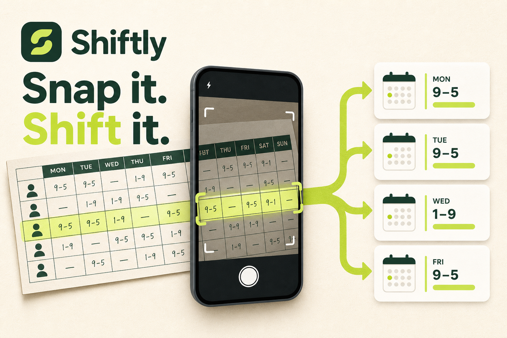
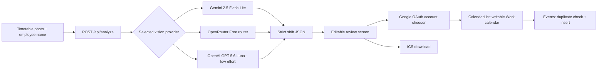

# Shiftly

Turn a photo of a weekly paper work timetable into reviewed Google Calendar shifts.

Shiftly finds an employee by name, reads their row across the weekly columns, converts the detected times into editable events, and adds approved shifts to a writable Google Calendar named **Work**.



> Status: private early release. The interface and deployment are working. Timetable extraction needs a key for one supported vision provider, while direct Google Calendar sync needs the Google OAuth client ID described below. Shiftly never substitutes sample shifts when real analysis is unavailable.

## Contents

- [Product flow](#product-flow)
- [Features](#features)
- [Architecture](#architecture)
- [Requirements](#requirements)
- [Local setup](#local-setup)
- [AI provider setup](#ai-provider-setup)
- [Google Calendar setup](#google-calendar-setup)
- [Environment variables](#environment-variables)
- [Development and validation](#development-and-validation)
- [Deployment](#deployment)
- [Privacy and security](#privacy-and-security)
- [Troubleshooting](#troubleshooting)
- [Known limitations](#known-limitations)

## Product flow

1. Enter the name exactly as it appears on the paper timetable.
2. Take a photo or select one from the device.
3. Shiftly finds the matching employee row and reads each day column.
4. Review the extracted dates and times. Low-confidence cells are highlighted.
5. Select, edit, or remove shifts before continuing.
6. Choose a Google account through Google's account chooser.
7. Add the selected events to that account's writable `Work` calendar.

Nothing is written to Google Calendar before the final confirmation button is pressed. An `.ics` download is available when Google Calendar is not connected.

## Features

- Mobile camera capture and desktop image upload
- Automatic client-side optimization of large timetable photos
- Employee-name row matching
- Day-header and date interpretation
- User-selectable Google Gemini, OpenRouter Free, or OpenAI vision analysis
- Google Gemini free tier selected by default
- Session-only API key input with no browser storage
- Editable start and end times
- Low-confidence warnings instead of silent guessing
- Google account chooser with the connected email shown in the UI
- Writable `Work` calendar discovery
- Duplicate protection using private Google Calendar event properties
- `.ics` calendar export
- Responsive, keyboard-accessible review flow
- Fail-closed configuration errors instead of fabricated demo shifts

## Architecture



### Application layers

| Area | Location | Responsibility |
| --- | --- | --- |
| Main interface | `app/page.tsx` | Photo selection, shift review, Google connection, event insertion, and ICS export |
| Analysis endpoint | `app/api/analyze/route.ts` | File validation, image encoding, provider selection, and structured response parsing |
| Styling | `app/globals.css` | Responsive layout and visual system |
| Metadata | `app/layout.tsx` | Page title, description, icons, and social preview |
| Runtime configuration | `next.config.ts` | Allows optimized timetable uploads through the hosted request layer |
| Hosting worker | `worker/index.ts` | Cloudflare-compatible application entrypoint |
| Hosting configuration | `.openai/hosting.json` | Sites project and optional resource bindings |

The browser accepts JPEG, PNG, and WebP images up to 50 MB. Files larger than 3 MB are resized to a maximum 3200-pixel edge and progressively encoded as JPEG until they fit safely within the hosted request limit, including multipart overhead. The analysis endpoint applies a final 10 MB limit, then sends the image to the selected provider in memory. Every provider is required to return the same strict schema containing the day, date, start time, end time, title, and confidence for every detected shift.

## Requirements

- Node.js 22.13 or newer
- npm
- An API key for at least one supported provider: Google Gemini, OpenRouter, or OpenAI
- A Google Cloud project
- Google Calendar API enabled in that project
- A Google OAuth 2.0 web client ID
- A Google Calendar named exactly `Work`

## Local setup

```bash
git clone https://github.com/AyBeeee/shiftly.git
cd shiftly
npm install
cp .env.example .env.local
```

Add the required values to `.env.local`:

```env
GEMINI_API_KEY=your_optional_gemini_api_key
OPENROUTER_API_KEY=your_optional_openrouter_api_key
OPENAI_API_KEY=your_openai_api_key
NEXT_PUBLIC_GOOGLE_CLIENT_ID=your_google_oauth_web_client_id
```

Only one AI provider key is needed. All three server values are optional when users enter their own key in the app for the current tab.

Start the local server:

```bash
npm run dev
```

Open the exact local URL printed in the terminal. Restart the development server after changing environment values.

## AI provider setup

Choose a provider in the upload screen, open its key-creation link, and paste the key into the password-masked field. The key remains only in React memory for the current tab and is not written to local storage. Alternatively, configure one or more private server secrets so users of the private deployment do not need to enter keys.

| Provider | Server secret | Model or route | Notes |
| --- | --- | --- | --- |
| Google Gemini | `GEMINI_API_KEY` | `gemini-2.5-flash-lite` | Default option; Google offers a limited free tier, subject to account, region, and rate limits |
| OpenRouter Free | `OPENROUTER_API_KEY` | `openrouter/free` | Routes to an available free model that supports images and structured output; availability and results can vary |
| OpenAI | `OPENAI_API_KEY` | `gpt-5.6-luna` | Low reasoning effort and high image detail |

Never expose any provider key through a `NEXT_PUBLIC_` variable or commit it to source control. A hosted secret is used only when the user has not supplied a session key for that provider.

The extraction prompt explicitly finds the printed day/date headers, matches only the requested employee row, reads its cell intersections from left to right, and ignores blank cells, days off, totals, store hours, highlighting, and neighboring rows. OpenAI uses high image detail because timetable cells contain small text; its low reasoning effort keeps usage modest.

If the selected provider has neither a hosted key nor a session key, `/api/analyze` returns a clear configuration error and no shifts. It never substitutes sample events for an uploaded timetable.

## Google Calendar setup

### 1. Prepare Google Cloud

1. Create or select a project in Google Cloud Console.
2. Enable the **Google Calendar API**.
3. Configure the OAuth consent screen.
4. Add yourself as a test user while the OAuth app remains in testing mode.
5. Create an OAuth 2.0 client ID with application type **Web application**.

### 2. Add authorized origins

Add every origin from which Shiftly will run. Typical values are:

```text
http://localhost:3000
https://shiftly-work-rota.baig-wally.chatgpt.site
```

If the local server chooses another port, add the exact origin it prints. This token-based browser flow does not require a redirect URI.

### 3. Configure the app

Copy the OAuth **client ID** into `NEXT_PUBLIC_GOOGLE_CLIENT_ID`. Do not create or add a client secret to the browser application.

### 4. Create the destination calendar

In the Google account that will receive shifts:

1. Open Google Calendar.
2. Create a new calendar.
3. Name it exactly `Work`.
4. Ensure the connected account has write access.

### How Shiftly chooses the account

**Connect Google** opens Google's own account chooser. Google returns a short-lived OAuth access token for the selected account. Shiftly uses that token to:

1. Display the selected account email.
2. Request that user's calendar list with a minimum access role of `writer`.
3. Find the writable calendar whose name equals `Work`.
4. Check for existing Shiftly events.
5. Insert the approved events.

The token is held in memory only. Reloading the page or token expiration requires reconnecting.

## Environment variables

| Variable | Required | Exposure | Purpose |
| --- | --- | --- | --- |
| `GEMINI_API_KEY` | Optional | Server secret | Hosted Google Gemini timetable analysis |
| `OPENROUTER_API_KEY` | Optional | Server secret | Hosted OpenRouter free-model timetable analysis |
| `OPENAI_API_KEY` | Optional | Server secret | Hosted OpenAI timetable analysis |
| `NEXT_PUBLIC_GOOGLE_CLIENT_ID` | For Google sync | Public browser identifier | Starts Google's OAuth account chooser |

At least one AI key must be supplied either as a server secret or through the session-only field. `.env.example` contains names only and is safe to commit. `.env`, `.env.local`, and other real environment variants are ignored by Git.

## Development and validation

| Command | Purpose |
| --- | --- |
| `npm run dev` | Start the development server |
| `npm run lint` | Run ESLint |
| `npm run build` | Build the production worker and static assets |
| `npm run start` | Start the built application locally |

Before committing a release:

```bash
npm run lint
npm test
```

The rendered-worker tests cover the application shell, provider configuration response, fail-closed key handling, image-type validation, and unknown-provider rejection. Live provider calls and Google writes are intentionally not run by the automated suite because they require private credentials and create external usage.

## Deployment

The project is configured for a private Sites deployment and produces Cloudflare Worker-compatible output.

Deployment requirements:

1. Run `npm run build` successfully.
2. Optionally configure one or more of `GEMINI_API_KEY`, `OPENROUTER_API_KEY`, and `OPENAI_API_KEY` as hosting secrets. Without them, users provide a session key in the app.
3. Configure `NEXT_PUBLIC_GOOGLE_CLIENT_ID` as an environment value.
4. Add the deployed origin to the Google OAuth web client.
5. Deploy the validated commit.
6. Test Google connection and a real timetable before routine use.

The current private deployment is:

[https://shiftly-work-rota.baig-wally.chatgpt.site](https://shiftly-work-rota.baig-wally.chatgpt.site)

Private Sites access may show a separate ChatGPT hosting sign-in before Shiftly loads. That gate controls who can open the private deployment; the Google account chooser independently controls which calendar receives events.

## Privacy and security

- Timetable images are processed in memory by the application and sent to the provider selected by the user.
- The application does not write uploaded photos to its database or filesystem.
- The employee name is saved in the browser's local storage for convenience.
- Hosted AI keys are used only on the server. A key entered in the app is held in React memory for the current tab, sent to Shiftly over HTTPS for analysis, and never written to browser storage or the repository.
- The Google OAuth client ID is public by design and is not a secret.
- Google access tokens stay in browser memory and are not written to local storage or the server.
- Calendar access is requested only through Google's consent flow.
- No event is inserted before the user reviews the shifts and presses the final button.
- Duplicate detection uses a private `shiftlyKey` event property.
- Real environment files are excluded from source control.

Review the data-processing and retention settings of the selected AI provider and Google before using Shiftly with employee information. Free tiers may apply different data-use terms from paid API service.

## Troubleshooting

| Message or symptom | Likely cause | Fix |
| --- | --- | --- |
| AI key is requested | The selected provider has no private hosted key | Enter its key in the password-masked panel for this tab, choose another configured provider, or configure the hosted secret |
| Free provider is rate-limited | Its current free quota or model capacity is unavailable | Wait and retry, or choose another provider |
| `Google Calendar needs a Google OAuth web client ID` | `NEXT_PUBLIC_GOOGLE_CLIENT_ID` is missing | Add the client ID and rebuild/redeploy |
| Google popup reports an origin error | Current origin is not authorized | Add the exact scheme, host, and port to Authorized JavaScript origins |
| Google consent blocks the user | OAuth app is in testing and the account is not allowed | Add the account as an OAuth test user or publish the consent app |
| No writable calendar named `Work` | Calendar is missing, differently named, or read-only | Create `Work` or grant the selected account write access, then reconnect |
| Google session expired | Short-lived access token expired | Press **Connect Google** and retry |
| No shifts found | Name mismatch or unreadable image | Use the printed name and retake the photo with the full table visible |
| Photo is too large | The original exceeds 50 MB or remains oversized after optimization | Crop closer to the timetable, then choose the photo again |
| Unsupported image | The file is not JPEG, PNG, or WebP | Export or convert the photo to JPEG |
| Times appear uncertain | One or more cells were difficult to read | Correct highlighted values before importing |
| Events use an unexpected timezone | Browser timezone differs from the work location | Correct the device/browser timezone before importing |

## Known limitations

- The complete day/date header and employee-name column must be visible.
- Employee matching works best with the exact printed name.
- Only one timetable image is analyzed per import.
- Free provider quotas, model availability, latency, and extraction quality can vary.
- The destination calendar name is fixed to `Work`.
- Overnight shifts are not yet modeled across two dates.
- Access tokens are not refreshed in the background.
- Unusual layouts, handwriting, glare, blur, or perspective distortion may require manual corrections.
- Provider extraction still requires human review before calendar insertion.

## Repository policy

- The repository is private.
- Do not commit `.env` files, API keys, OAuth tokens, or employee timetable photos.
- Keep secrets in local or hosted environment configuration only.
- Run lint and build before pushing changes.

## License

Private project. No license is granted for copying, redistribution, or commercial use.
