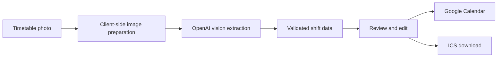

# Shiftly

Shiftly turns a photo of a weekly paper work timetable into reviewed Google Calendar events.

I built it to remove a small but repetitive task: copying every shift from a printed rota into a phone calendar. A user enters their name, uploads one photo, checks the extracted shifts, and then exports them as an `.ics` file or adds them to a writable Google Calendar.


## What it does

- Accepts JPEG, PNG, WebP, HEIC, and HEIF timetable photos
- Finds the employee row that best matches the entered name
- Extracts dates and shift times with OpenAI vision
- Flags uncertain results instead of silently guessing
- Lets the user edit, select, or remove every shift before export
- Adds approved shifts to a chosen Google Calendar
- Prevents duplicate Google Calendar events
- Exports the same reviewed shifts as an `.ics` file

The hosted app is kept private because each analysis uses a paid API and timetables can contain employee information. The repository is public so the implementation and decisions can be reviewed safely.

## How it works



Large images are resized in the browser before upload. HEIC and HEIF photos are converted locally so they can be previewed and processed without adding native image dependencies to the worker.

The server sends the normalized image to the OpenAI Responses API and requires a strict JSON schema. It then validates every date, time, confidence value, and shift duration before returning anything to the browser. The app never creates fallback shifts when analysis is unavailable.

Google Calendar access happens through Google's OAuth flow. Access tokens remain in browser memory, and no event is written until the user reviews the result and confirms the import.

## Engineering highlights

- End-to-end TypeScript with React 19 and a Next-compatible Vinext runtime
- Cloudflare Worker output for lightweight hosting
- Structured AI output with server-side validation and clear failure states
- Lazy-loaded HEIC conversion to keep the normal upload path small
- Client-side image resizing for reliable uploads up to a 50 MB source file
- Duplicate protection through private Google Calendar event properties
- Overnight-shift handling across review, ICS export, and Google Calendar sync
- Automated checks for rendered output, upload validation, configuration failures, and calendar behavior

## Tech stack

| Area | Tools |
| --- | --- |
| Front end | React 19, TypeScript, CSS |
| Application framework | Vinext, Vite, Next-compatible APIs |
| AI extraction | OpenAI Responses API with structured output |
| Calendar integration | Google Identity Services and Google Calendar API |
| Image handling | Canvas API and `heic2any` |
| Hosting | Cloudflare Workers through OpenAI Sites |
| Quality | ESLint, TypeScript, Node test runner, GitHub Actions |

## Run it locally

You will need Node.js 22.13 or newer, an OpenAI API key, and a Google OAuth web client ID with the Google Calendar API enabled.

```bash
git clone https://github.com/AyBeeee/shiftly.git
cd shiftly
npm install
cp .env.example .env.local
```

Add your credentials to `.env.local`:

```env
OPENAI_API_KEY=your_openai_api_key
GOOGLE_CLIENT_ID=your_google_oauth_client_id
```

Then start the development server:

```bash
npm run dev
```

For Google sign-in, add the exact local origin printed by the development server to the OAuth client's **Authorized JavaScript origins**. A client secret is not needed for this browser-based flow.

## Validation

```bash
npx tsc --noEmit
npm run lint
npm test
git diff --check
```

`npm test` creates a production worker build and checks the rendered app, runtime configuration, image validation, structured-result handling, overnight shifts, and selected-calendar behavior. Live OpenAI calls and Google writes are deliberately excluded from automated tests.

## Privacy and security

- Timetable photos are processed in memory and are not stored by the app.
- The OpenAI API key stays on the server.
- Google access tokens stay in browser memory and disappear on reload.
- The employee name is stored only in the user's browser for convenience.
- Calendar events are created only after explicit review and confirmation.
- Real credentials, timetable photos, and environment files are excluded from source control.

Anyone deploying their own copy should review the data-processing and retention settings of OpenAI and Google before using real employee information.

## Current limitations

- The full day/date header and employee-name column need to be visible in the photo.
- Unusual layouts, handwriting, glare, blur, or perspective distortion may need manual correction.
- Access tokens are not refreshed in the background.
- Extraction quality and latency depend on the model and source image.
- Every extracted shift still needs human review before it is added to a calendar.

## License

This project is available under the [MIT License](LICENSE).
